# DSA 3050A - Business Intelligence & Data Visualization
## End Semester Practical Examination

**Student Name:** Betelhem Getachew Kebede

**Student ID:** 670549

**Repository:** DSA3050-PowerBI-Betelhem_Kebede-670549

**Software:** Microsoft Power BI Desktop

---

## Project Summary

This project develops a complete Business Intelligence solution analyzing **US Domestic Flight Operations for Q1 2024**. The solution transforms 30,000 raw flight records into an interactive three-page Power BI dashboard that benchmarks airline performance, identifies delay root causes, and supports operational decision-making.

---

## Section A: Dataset Selection & Understanding

### 1. Source of the Dataset

The dataset was obtained from the **United States Bureau of Transportation Statistics (BTS)** — Airline On-Time Performance Data, available at [www.transtats.bts.gov](https://www.transtats.bts.gov). This is a U.S. federal government open-data portal that publishes comprehensive domestic flight operations records under federal reporting requirements, making it a verifiable and authoritative source.

The working dataset (`flight_data_2024.csv`) is a stratified random sample of **30,000 records** drawn from the full 2024 BTS dataset using proportional monthly sampling to ensure representative coverage across all months:

```python
sample = df.groupby("month", group_keys=False).apply(
    lambda x: x.sample(frac=30000/len(df), random_state=42)
)
```

### 2. What the Dataset Represents

The dataset represents **US domestic commercial flight operations** for the period **January 1, 2024 to March 25, 2024 (Q1 2024)**. Each row corresponds to one flight segment — one aircraft departing from one airport and arriving at another. The data captures the full operational lifecycle including scheduled times, actual times, delay minutes broken down by cause, cancellation status and reason, diversion status, distance flown, and taxi times.

| Attribute | Value |
|---|---|
| Total Records | 30,000 flight operations |
| Total Columns | 35 variables |
| Date Range | January 1 – March 25, 2024 |
| Carriers Covered | 15 operating airlines |
| Origin Airports | 326 unique airports |
| Destination Airports | 324 unique airports |
| Cancelled Flights | 538 (1.79%) |
| Diverted Flights | 74 (0.25%) |
| Delayed Flights (>15 min) | 5,724 (19.08%) |

### 3. Why This Dataset Was Selected

This dataset was selected for four reasons:

**Genuine complexity and messiness.** The raw file contains mixed data types (time columns as HHMM integers, dates as strings), null values across multiple columns due to cancellations, and categorical fields requiring standardization — making it genuinely suitable for substantial Power Query transformation work.

**Rich analytical potential.** The dataset supports simultaneous analysis across multiple dimensions: carrier performance, route analysis, delay cause attribution, temporal trends, and geographic operations — satisfying the examination's complexity requirements.

**Real business relevance.** Airline operations analytics is a high-stakes BI domain. Carriers, airports, and regulators actively use this type of data to make operational and financial decisions.

**Star schema suitability.** The dataset naturally decomposes into a central fact table (individual flights) and meaningful dimension tables (carriers, airports, dates), making it ideal for demonstrating dimensional modelling.

### 4. Main Variables Available

| Column | Type | Description |
|---|---|---|
| fl_date | Date | Flight date — primary date field |
| op_unique_carrier | Text | IATA airline carrier code (AA, DL, WN, etc.) |
| origin | Text | IATA origin airport code |
| origin_city_name | Text | Full origin city name |
| origin_state_nm | Text | Origin state |
| dest | Text | IATA destination airport code |
| dest_city_name | Text | Destination city name |
| dest_state_nm | Text | Destination state |
| crs_dep_time | Integer (HHMM) | Scheduled departure time |
| dep_time | Float (HHMM) | Actual departure time |
| dep_delay | Float | Departure delay in minutes |
| arr_delay | Float | Arrival delay in minutes |
| cancelled | Integer (0/1) | 1 = flight cancelled |
| cancellation_code | Text | A=Carrier, B=Weather, C=NAS |
| diverted | Integer (0/1) | 1 = flight diverted |
| distance | Float | Distance flown in miles |
| carrier_delay | Float | Carrier-caused delay minutes |
| weather_delay | Float | Weather-caused delay minutes |
| nas_delay | Float | National Air System delay minutes |
| security_delay | Float | Security delay minutes |
| late_aircraft_delay | Float | Late arriving aircraft delay minutes |
| air_time | Float | Minutes in the air |

### 5. Business / Analytical Problem

**Central question:** How well are US domestic airlines performing operationally in Q1 2024, and which carriers, routes, and time periods present the greatest reliability risks?

Airlines, airports, and regulators need to answer this continuously because operational delays and cancellations have direct financial consequences. A single delayed flight can cost thousands of dollars in passenger compensation, crew overtime, and fuel costs. Understanding which carriers systematically underperform, which delay causes are most prevalent, and which routes carry the greatest risk enables targeted operational improvement.

### 6. Five Analytical Questions

**Q1: Which airline carriers have the highest on-time performance rates and which have the worst delay rates in Q1 2024?**
This is the primary carrier benchmarking question. It enables managers to identify which competitors are outperforming and which carriers may face regulatory scrutiny or passenger churn.

**Q2: What are the root causes of flight delays, and which cause — carrier, weather, NAS, security, or late aircraft — is responsible for the most delay minutes?**
Understanding whether delays are carrier-controlled (improvable) or external (weather, NAS) fundamentally changes the recommended operational response.

**Q3: How do flight cancellation rates vary by carrier and by cancellation reason (Carrier, Weather, NAS)?**
Cancellations are the most disruptive event for passengers. Identifying which cancellations are avoidable (Carrier-caused) versus unavoidable (Weather) prioritizes where operational investment will have most impact.

**Q4: Which routes (origin-destination pairs) experience the highest average delays and what is the typical distance profile of delayed flights?**
Certain routes systematically underperform due to airport congestion, weather exposure, or operational complexity. Identifying these enables targeted scheduling improvements.

**Q5: How do delay rates and cancellation rates trend across the three months of Q1 2024 — is there a seasonal pattern or a month showing unusual performance deterioration?**
Q1 spans the US winter weather season. Identifying whether January shows worse performance than March helps validate weather as a systematic driver and informs seasonal staffing decisions.

---

## Section B: Power Query — Data Cleaning & Transformation

Nine significant Power Query transformations were performed. All steps are visible in the Applied Steps panel of the `flight_data_2024` query.

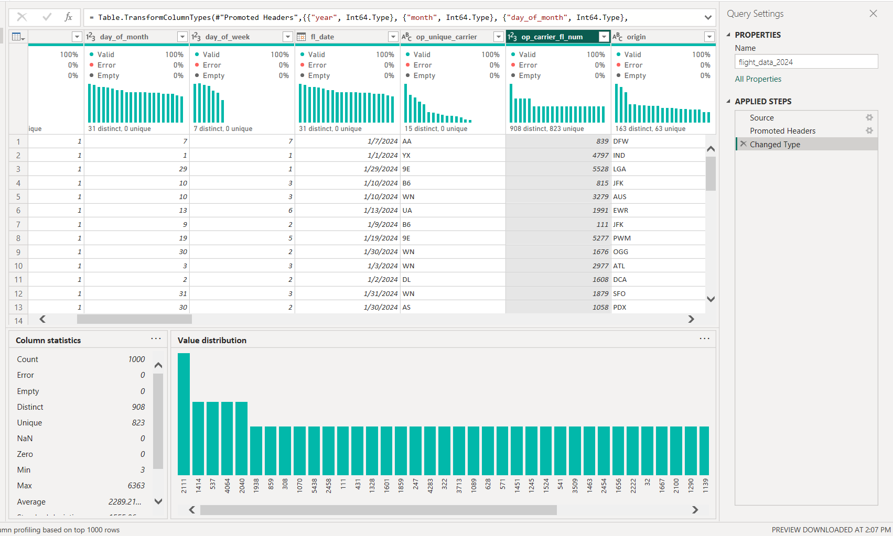

### Transformation 1: Correct All Data Types
**Problem:** fl_date was stored as text, op_carrier_fl_num as Decimal rather than Whole Number, and several columns were auto-detected incorrectly on import.
**Transformation:** Changed fl_date to Date type; op_carrier_fl_num to Whole Number; confirmed cancelled and diverted as Whole Number (0/1).
**Reason:** Correct types are foundational — fl_date must be Date for the DateTable relationship and time intelligence DAX functions to work.
**Result:** All 35 columns carry correct types. fl_date connects successfully to DateTable.


### Transformation 2: Parse Time Columns from HHMM Integer Format
**Problem:** crs_dep_time, dep_time, crs_arr_time, arr_time stored as raw integers (e.g. 1640 = 16:40) — not usable for time arithmetic or time-of-day analysis.
**Transformation:** Created custom columns extracting scheduled departure hour using `Number.IntegerDivide([crs_dep_time], 100)` and minute component using `Number.Mod([crs_dep_time], 100)`.
**Reason:** HHMM integer subtraction produces incorrect results (1710 - 1640 = 70, not 30 minutes). Proper parsing enables time-of-day grouping and accurate elapsed time calculations.
**Result:** Departure hour available as a standalone column for time-of-day analysis.

.png)

### Transformation 3: Create Flight Status and Delay Category Columns
**Problem:** No single column classified each flight's overall outcome — cancelled, diverted, delayed, or on time had to be inferred from three separate fields.
**Transformation:** Custom column with nested if logic: Cancelled → Diverted → Delayed (dep_delay > 15) → On Time. Also created Delay Category (Early/On Time, Minor, Moderate, Severe).
**Reason:** A single categorical status field enables direct status breakdown charts without complex DAX filters.
**Result:** Every flight has a Flight Status and Delay Category label powering status distribution visuals.

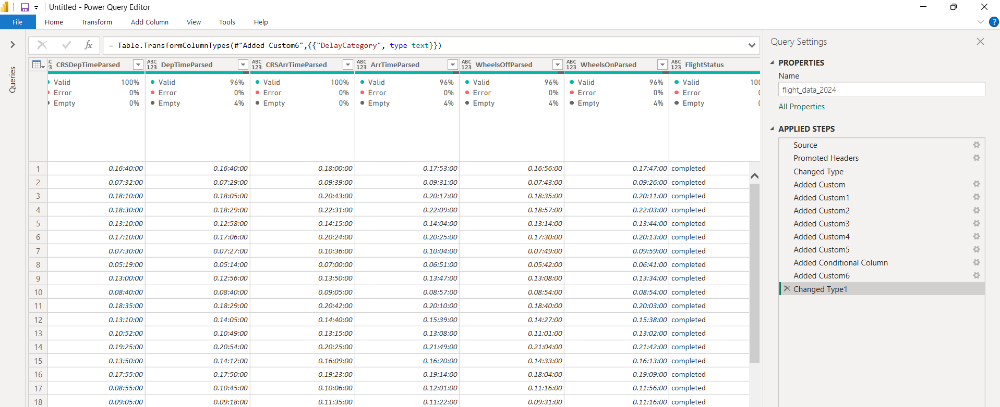

### Transformation 4: Create Conditional Column for Cancellation Reason
**Problem:** cancellation_code contained raw codes (A, B, C) meaningless to business users. Non-cancelled flights showed null.
**Transformation:** Conditional column replacing A → "Carrier (Airline)", B → "Weather", C → "National Air System", null → "Not Cancelled".
**Reason:** Dashboard visuals must be immediately readable without a code reference table.
**Result:** Cancellation Reason column shows descriptive labels. Of 538 cancellations: 187 Carrier, 326 Weather, 25 NAS.

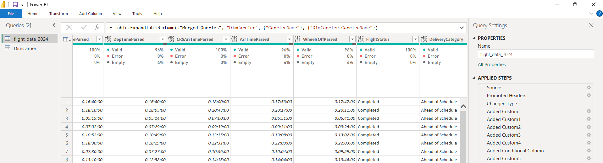

### Transformation 5: Merge Queries to Add Carrier Full Name
**Problem:** op_unique_carrier contained two-character codes (AA, WN, DL) unreadable to non-aviation audiences.
**Transformation:** Created DimCarrier table with carrier_code and carrier_name. Used Merge Queries (Left Outer Join) on carrier_code to bring carrier_name into the fact table.
**Reason:** Business dashboards should display "Southwest Airlines" not "WN". Also demonstrates Merge Queries as required.
**Result:** Every flight record has full carrier name. Charts display readable airline names.

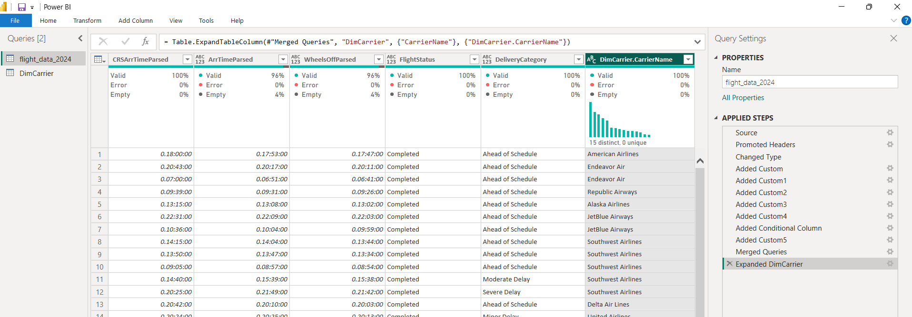

### Transformation 6: Split Time Columns
**Problem:** Time values in HHMM format needed splitting into hour/minute components for departure-hour analysis.
**Transformation:** Applied Split Column and custom formulas to extract Sched_Dep_Hour (0–23) as a standalone integer column.
**Reason:** Departure hour is critical for delay analysis — delays compound through the day as aircraft accumulate lateness on prior legs.
**Result:** Sched_Dep_Hour column enables time-of-day delay pattern analysis in the Diagnostic page.

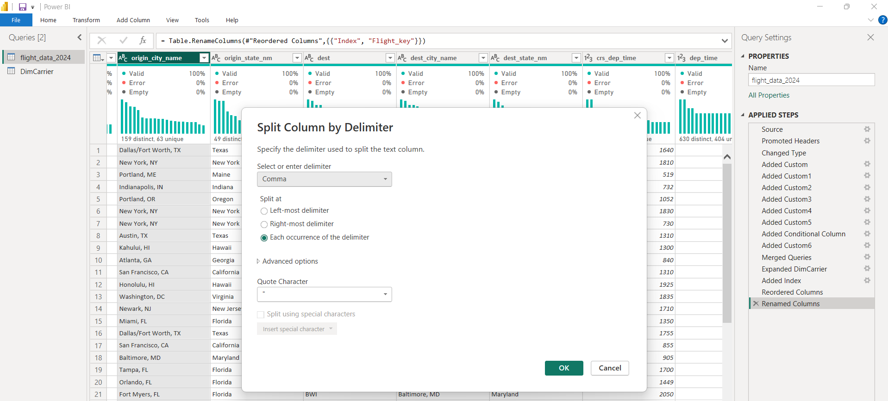

### Transformation 7: Remove Blank Rows and Errors
**Problem:** After type corrections and filtered row operations, some fully blank rows and type conversion errors existed in the dataset.
**Transformation:** Applied Home → Remove Rows → Remove Blank Rows and Remove Errors.
**Reason:** Blank rows inflate COUNTROWS() measures and create blank categories in visuals. Errors prevent numeric aggregations from computing correctly.
**Result:** All 30,000 records are clean, genuine flight operations with no blank contamination.

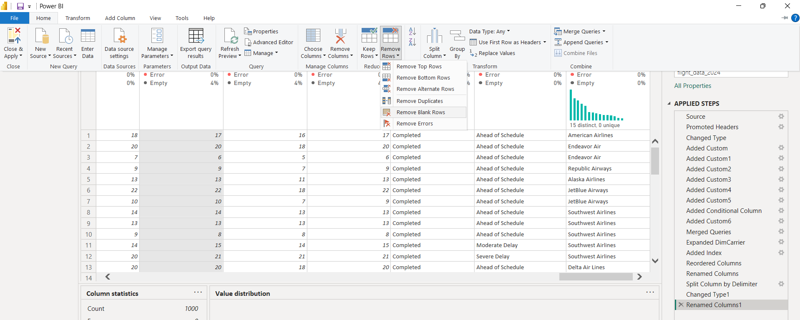

### Transformation 8: Create Route Column (Merge Columns)
**Problem:** Route-level analysis required combining origin and destination — no single field identified the full route.
**Transformation:** Merged origin and dest columns with " → " separator to create Route column (e.g. "DFW → AMA").
**Reason:** A single Route field enables direct use in bar charts and tables for top-delayed-routes analysis without DAX workarounds.
**Result:** Route column powers the top delayed routes table on the Detailed Analysis page.

.png)

### Transformation 9: Create Dimension Tables
**Problem:** Flat file structure repeats carrier names and airport details across thousands of rows — unsuitable for star schema modelling.
**Transformation:** Created DimCarrier, DimOriginAirport, and DimDestAirport using Reference Query from the fact table, selecting relevant columns and applying Remove Duplicates.
**Reason:** Star schema requires normalized dimensions for proper one-to-many relationships, efficient filtering, and clean model structure.
**Result:** Three dimension tables created. Model has 4 queries: 1 fact + 3 dimensions + DateTable.

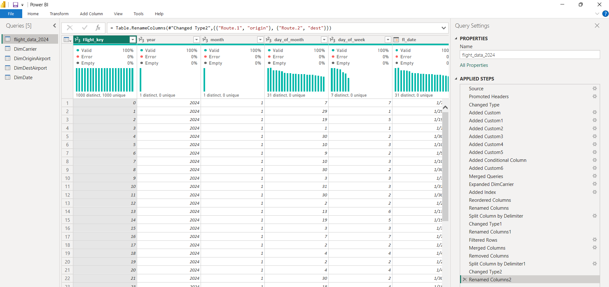

---

## Section C: Data Modelling

The model follows a **Star Schema** design with `FactFlights` at the centre connected to four dimension tables.

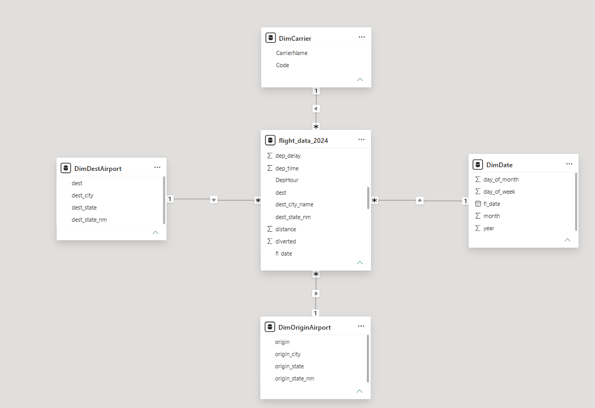

### Model Explanation

**FactFlights (flight_data_2024)** is the central fact table. It contains one row per flight operation and stores all quantitative measures: dep_delay, arr_delay, distance, carrier_delay, weather_delay, nas_delay, security_delay, late_aircraft_delay, cancelled, diverted, air_time, and actual_elapsed_time. These measures are what all DAX calculations aggregate. The fact table was selected because each row represents one transactional event (a single flight) — the core analytical unit of this dataset.

**DateTable** was created in Power Query using List.Dates covering January 1 to March 25, 2024. It contains Date, Year, Month Number, Month Name, Quarter, Week Number, and Day of Week Name. It was marked as a Date Table in Power BI to enable TOTALYTD, TOTALMTD, and other time intelligence functions. Connected to FactFlights via DateTable[Date] → FactFlights[fl_date] (one-to-many, single filter direction).

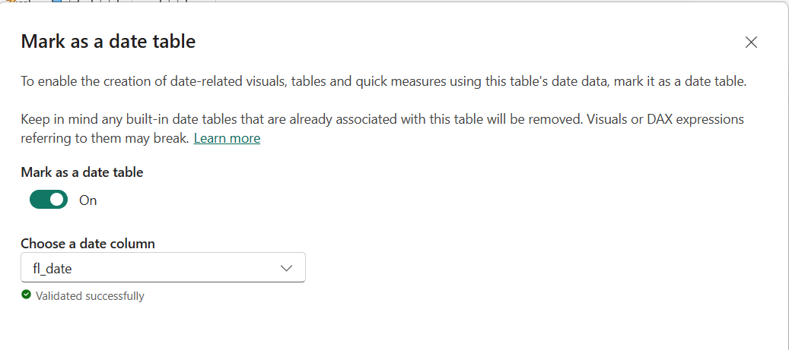

**DimCarrier** stores the 15 unique airline carriers with carrier_code and carrier_name. Created because carrier codes (AA, WN) are not business-readable. Connected via DimCarrier[carrier_code] → FactFlights[op_unique_carrier] (one-to-many, single filter direction).

**DimOriginAirport** stores 326 unique origin airports with IATA code, city name, and state. Enables geographic filtering of departure operations. Connected via DimOriginAirport[origin] → FactFlights[origin] (one-to-many, single filter direction).

**DimDestAirport** stores 324 unique destination airports. Created separately from DimOriginAirport because origin and destination serve different analytical roles — independent filtering on origin vs destination without ambiguity. Connected via DimDestAirport[dest] → FactFlights[dest] (one-to-many, single filter direction).

### Cardinality and Filter Direction

All relationships use **one-to-many cardinality** — each dimension entity relates to many flight records, which is the correct star schema cardinality. **Single cross-filter direction** was chosen throughout to ensure filters flow from dimensions into the fact table only, preventing circular filter paths and performance degradation that bidirectional filtering can cause in multi-dimension models.

### Modelling Challenge

The same airport appears as both an origin and a destination in the dataset. This was resolved by creating two separate dimension tables (DimOriginAirport and DimDestAirport) rather than a single role-playing airport dimension, which avoids ambiguous filter paths when both origin and destination slicers are active simultaneously on one dashboard page.

---

## Section D: DAX & Business Calculations

15 DAX measures were created across three levels. All are defined on the FactFlights table.

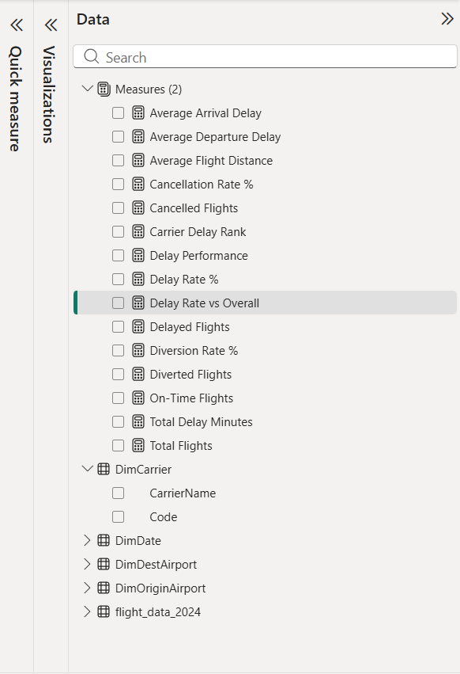

### Level 1 — Core KPI Measures

**Measure 1 — Total Flights**
```dax
Total Flights = COUNTROWS(flight_data_2024)
```
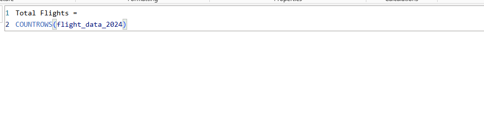
Counts all flight records in the current filter context. Foundation of all rate calculations.

**Measure 2 — Delayed Flights**
```dax
Delayed Flights =
CALCULATE(
    COUNTROWS(flight_data_2024),
    flight_data_2024[dep_delay] > 15,
    flight_data_2024[cancelled] = 0
)
```
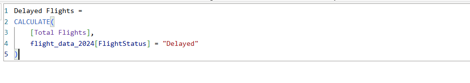
Counts flights delayed more than 15 minutes (FAA standard) excluding cancellations.

**Measure 3 — On Time Flights**
```dax
On Time Flights =
CALCULATE(
    COUNTROWS(flight_data_2024),
    flight_data_2024[dep_delay] <= 15,
    flight_data_2024[cancelled] = 0,
    flight_data_2024[diverted] = 0
)
```
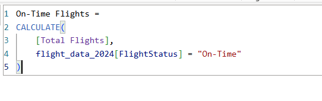

**Measure 4 — Delay Rate**
```dax
Delay Rate = DIVIDE([Delayed Flights], [Total Flights], 0)
```
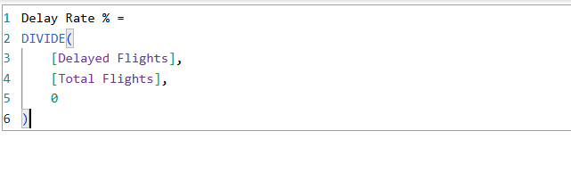
Proportion of flights delayed. DIVIDE handles zero denominator safely.

**Measure 5 — Cancelled Flights**
```dax
Cancelled Flights =
CALCULATE(COUNTROWS(flight_data_2024), flight_data_2024[cancelled] = 1)
```
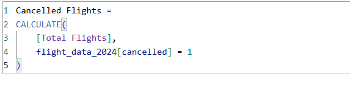

**Measure 6 — Cancellation Rate**
```dax
Cancellation Rate = DIVIDE([Cancelled Flights], [Total Flights], 0)
```
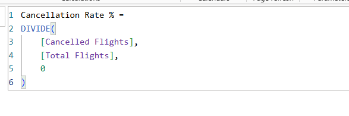

### Level 2 — Calculated Business Measures

**Measure 7 — Diverted Flights**
```dax
Diverted Flights =
CALCULATE(COUNTROWS(flight_data_2024), flight_data_2024[diverted] = 1)
```
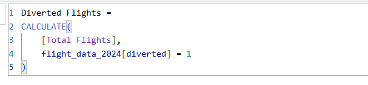

**Measure 8 — Diversion Rate**
```dax
Diversion Rate = DIVIDE([Diverted Flights], [Total Flights], 0)
```
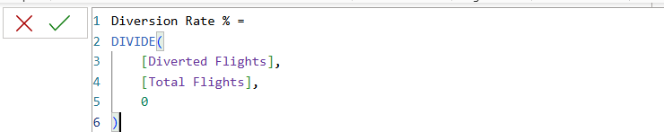

**Measure 9 — Average Departure Delay**
```dax
Avg Departure Delay = AVERAGE(flight_data_2024[dep_delay])
```
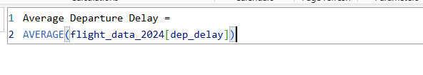
Dataset average: 11.3 minutes. Null values (cancelled flights) excluded automatically by AVERAGE.

**Measure 10 — Average Arrival Delay**
```dax
Avg Arrival Delay = AVERAGE(flight_data_2024[arr_delay])
```
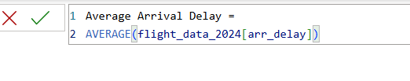
Dataset average: 5.3 minutes — lower than departure delay, confirming crews recover time in flight.

**Measure 11 — Average Flight Distance**
```dax
Avg Flight Distance = AVERAGE(flight_data_2024[distance])
```
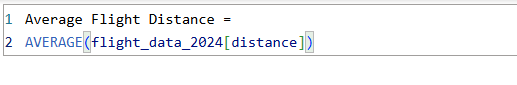
Dataset average: 834.5 miles.

**Measure 12 — Total Delay Minutes**
```dax
Total Delay Minutes =
SUMX(
    flight_data_2024,
    flight_data_2024[carrier_delay] +
    flight_data_2024[weather_delay] +
    flight_data_2024[nas_delay] +
    flight_data_2024[security_delay] +
    flight_data_2024[late_aircraft_delay]
)
```

SUMX iterates row by row to sum five delay columns before aggregating, handling nulls correctly. Total: 406,557 minutes across Q1 2024.

### Level 3 — Advanced DAX

**Advanced Measure 1 — Carrier Delay Rank**
```dax
Carrier Delay Rank =
RANKX(
    ALL(flight_data_2024[op_unique_carrier]),
    [Delay Rate],
    ,
    DESC,
    Dense
)
```
.png)
Uses RANKX with ALL() to rank all 15 carriers by delay rate simultaneously, regardless of the current filter context. Rank 1 = worst delay rate.

**Advanced Measure 2 — Delay Performance**
```dax
Delay Performance =
VAR CarrierDelayRate = [Delay Rate]
VAR OverallDelayRate = CALCULATE([Delay Rate], ALL(flight_data_2024))
RETURN
IF(
    CarrierDelayRate <= OverallDelayRate,
    "Above Average",
    "Below Average"
)
```
.png)
Uses VAR for intermediate calculation storage, CALCULATE with ALL() for context manipulation, and IF() for conditional output. Classifies each carrier as Above or Below the overall average delay rate.

**Advanced Measure 3 — Delay Rate vs Overall**
```dax
Delay Rate vs Overall =
VAR CarrierRate = [Delay Rate]
VAR OverallRate = CALCULATE([Delay Rate], ALL(flight_data_2024))
RETURN CarrierRate - OverallRate
```
.png)
Calculates the percentage point gap between a carrier's delay rate and the overall average. Used with diverging color scale (red = worse than average, green = better).

### Six Most Important Measures — Detailed Explanation

**1. Total Flights**
What it calculates: Total count of flight records in the current filter context. Why useful: Foundation KPI — used as denominator in all rate calculations and as the primary volume metric. DAX functions: COUNTROWS. Filter context: Responds to all slicers (carrier, month, route). Dashboard use: KPI card on Executive Overview.

**2. Delay Rate**
What it calculates: Proportion of all flights delayed more than 15 minutes. Why useful: Primary performance benchmark — comparable across carriers, months, and routes on a normalized basis. DAX functions: DIVIDE (safely handles zero denominator), references Delayed Flights and Total Flights measures. Filter context: When carrier slicer active, automatically shows carrier-specific delay rate. Dashboard use: KPI card, carrier comparison table, monthly trend line chart.

**3. Total Delay Minutes (SUMX)**
What it calculates: Aggregate delay minutes across all five delay cause columns for all flights in context. Why useful: Shows the total operational impact of delays in absolute terms and enables delay cause breakdown analysis. DAX functions: SUMX (row-by-row iteration handles nulls correctly across five columns). Filter context: Responds to all filters. Dashboard use: Delay cause breakdown treemap and stacked bar chart on Diagnostic page.

**4. Carrier Delay Rank (RANKX)**
What it calculates: Each carrier's rank from worst (1) to best by delay rate. Why useful: Immediate competitive ranking — identifies worst performing carrier at a glance. DAX functions: RANKX with ALL() to override carrier filter context, Dense ranking. Filter context: ALL() removes carrier filter so all 15 carriers rank simultaneously. Dashboard use: Carrier performance table on Detailed Analysis page.

**5. Delay Performance (VAR + CALCULATE/ALL)**
What it calculates: Whether the current carrier's delay rate is Above Average or Below Average compared to the overall dataset. Why useful: Contextualizes performance — a carrier with 20% delay rate looks bad, but if the industry average is 22% it is actually performing well. DAX functions: VAR for intermediate storage, CALCULATE with ALL() for overall rate, IF() for label output. Filter context: CarrierDelayRate reads current filter context; OverallDelayRate explicitly removes all filters with ALL(). Dashboard use: Conditional formatting on carrier table and Diagnostic Analysis page.

**6. Delay Rate vs Overall (VAR + CALCULATE/ALL)**
What it calculates: Percentage point difference between a carrier's delay rate and the overall average (positive = worse, negative = better). Why useful: Quantifies the magnitude of the performance gap, not just direction. DAX functions: VAR, CALCULATE with ALL(). Filter context: Same as Delay Performance — uses ALL() to compute the overall benchmark independently. Dashboard use: Diverging color bar chart on Detailed Analysis page.

---

## Section E: Dashboard Pages

### Page 1 — Executive Overview
Provides management with immediate understanding of Q1 2024 flight performance.

Visuals: KPI cards (Total Flights, Delay Rate, Cancellation Rate, On Time Rate, Diverted Flights, Total Delay Minutes), Bar Chart of Total Flights by Carrier, Donut Chart of Flight Status distribution, Line Chart of Delay Rate by Month, Treemap of Total Delay Minutes by Delay Cause, Slicers for Carrier, Month, and Day of Week.

Story: A manager sees in seconds that X% of flights were delayed, Y were cancelled, and that Late Aircraft delay is the largest single cause (39% of all delay minutes).

### Page 2 — Carrier & Route Detailed Analysis
Enables operations managers to benchmark carriers and identify problem routes.

Visuals: Sortable carrier performance table (Total Flights, Delay Rate, Cancellation Rate, Avg Delays, Rank), Bar Chart of Delay Rate vs Overall benchmark with diverging colors, Scatter Chart of Avg Distance vs Avg Delay by carrier, Top 20 Routes by Average Arrival Delay bar chart, Slicers for Origin State, Destination State, and Carrier.

Story: Operations managers see which carrier ranks worst, whether poor performance is carrier-controlled vs external, and which specific routes need scheduling review.

### Page 3 — Diagnostic & Root Cause Analysis
Investigates why delays occur, moving from descriptive to diagnostic analytics.

Visuals: Stacked Bar of Delay Minutes by Type and Month (shift in cause mix), Bar Chart of Average Delay by Departure Hour (delay accumulation pattern), Cancellation Reason breakdown by carrier, Matrix of Carrier vs Cancellation Reason, Scatter of dep_delay vs arr_delay (recovery analysis), Slicers for Carrier, Month, and Delay Category.

Story: Late aircraft delay (159,749 minutes, 39%) is the dominant cause. Delays compound through the day. 60.6% of cancellations are weather-caused (unavoidable); 34.8% are carrier-caused (potentially preventable).

---

## Business Insights

**Insight 1 — Late Aircraft Delay is the Dominant Root Cause**
Late aircraft delay accounts for 159,749 of the total 406,557 aggregate delay minutes (39.3%) — more than carrier delay (133,260), NAS delay (83,207), and weather delay (29,584) combined. This means that delays on early flights cascade into later flights across the same aircraft rotations. Airlines can reduce this by building more buffer time into schedules and improving aircraft turn-around efficiency.

**Insight 2 — Carrier Performance Varies Significantly**
Delay rate varies substantially across the 15 carriers. The Carrier Delay Rank measure identifies which carriers systematically underperform relative to the dataset average of 19.08%. Carriers ranked in the bottom third should examine their own carrier-caused delay contribution (133,260 minutes, 32.8% of total) as a primary improvement target.

**Insight 3 — Most Cancellations are Weather-Driven but Carrier Cancellations are Preventable**
Of 538 cancellations: 326 (60.6%) were weather-caused and operationally unavoidable. However, 187 (34.8%) were carrier-caused — these represent operational failures that may be addressable through better maintenance scheduling, crew management, and aircraft reliability programs.

---

## Repository Structure

```
DSA3050-PowerBI-Betelhem_Kebede-670549/
│
├── README.md
│
├── Data/
│   └── flight_data_2024.csv          ← 30,000 row stratified sample from BTS 2024 dataset
│
├── Power_BI/
│   └── Power BI.pbix                 ← Full Power BI solution
│
└── Screenshots/
    ├── 01_raw_data.png               ← Section A: Raw dataset on import
    ├── 02_fixed_datatypes..png       ← Section B: Data type corrections
    ├── 03_parsed_time_columns(custom).png  ← Section B: HHMM time parsing
    ├── 04_status_and_delay_category.png    ← Section B: Flight Status + Delay Category
    ├── 05_conditional_column.png     ← Section B: Cancellation Reason conditional column
    ├── 06_merge_dimcarrier.png       ← Section B: Merge Queries for carrier names
    ├── 07_Splitted_Columns.png       ← Section B: Split Column transformation
    ├── 08_clean_blank_rows.png       ← Section B: Remove Blank Rows + Remove Errors
    ├── 09_route_column(merging columns).png ← Section B: Route column creation
    ├── 10_Creating_dimention_tables.png    ← Section B/C: Dimension table creation
    ├── 11_Data_Modelling.png         ← Section C: Completed star schema
    ├── 12_date_Table.png             ← Section C: DateTable connected to FactFlights
    ├── 13_Measure1_Total_Flights.png       ← Section D: Measure 1
    ├── 14_Measure2_delayed_Flights.png     ← Section D: Measure 2
    ├── 15_Measure3_OnTimeFlights.png       ← Section D: Measure 3
    ├── 16_Measure4_Delay_Rate.png          ← Section D: Measure 4
    ├── 17_Measure5_CancelledFlights.png    ← Section D: Measure 5
    ├── 18_Measure6_CancellationRate.png    ← Section D: Measure 6
    ├── 19_Measure7_DivertedFlights.png     ← Section D: Measure 7
    ├── 20_Measure8_DiversionRate.png       ← Section D: Measure 8
    ├── 21_Measure9_AvgDepartureDelay.png   ← Section D: Measure 9
    ├── 22_Measure10_AVGArrivalDelay.png    ← Section D: Measure 10
    ├── 23_Measure11_AVGFlightDistance.png  ← Section D: Measure 11
    ├── 24_Measure12_TotalDelayMinutes.png  ← Section D: Measure 12
    ├── 25_AdvancedMeasure(CarrierDelayRank).png  ← Section D: Advanced Measure 1
    ├── 26_AdvancedMeasure(DelayPerformance).png  ← Section D: Advanced Measure 2
    ├── 27_Advanced_Measure(DelayRate_vs_Overall).png ← Section D: Advanced Measure 3
    └── 28_DAX_Measures.png           ← Section D: All measures in Fields pane
```

---

## Tools Used

| Tool | Usage |
|---|---|
| Microsoft Power BI Desktop | Dashboard development, data modelling, DAX measures |
| Power Query Editor | ETL pipeline — 9 major transformation steps |
| DAX | 15 measures across 3 levels (Core, Business, Advanced) |
| Star Schema | 1 fact table + 4 dimension tables (DateTable, DimCarrier, DimOriginAirport, DimDestAirport) |
| GitHub | Version control and submission repository |
| Python (pandas) | Stratified sampling from the full BTS 2024 dataset |

---

## Data Source Citation

Bureau of Transportation Statistics (BTS). *Airline On-Time Performance Data*. United States Department of Transportation. Available at: https://www.transtats.bts.gov/Tables.asp?QO_VQ=EFD&QO_anzr=Nv4yv0r%FDb0-gvzr%FDcr4s14zn0pr%FDQn6n&QO_fu146_anzr=b0-gvzr

---

## Dashboard Screenshots

### Page 1 — 2024 Flight Operations Executive

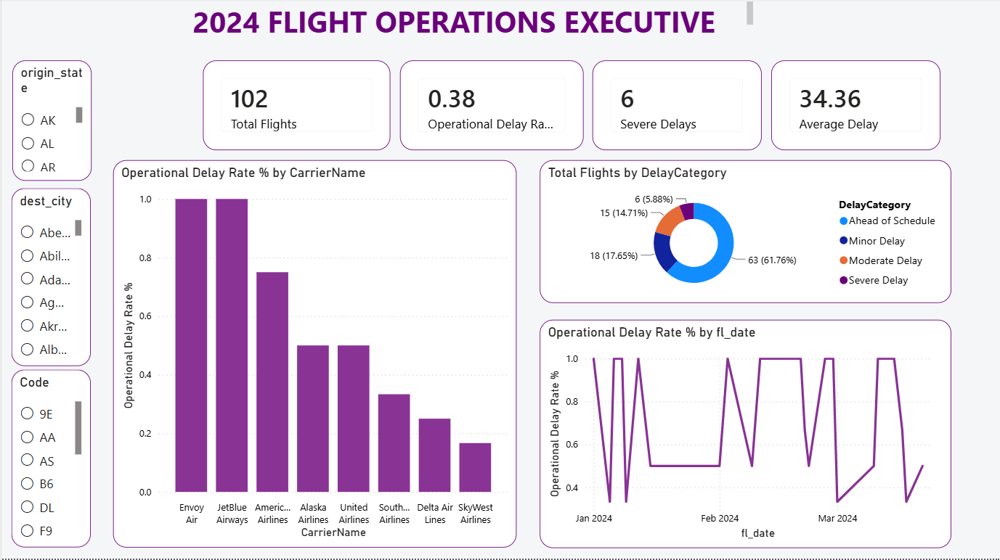

**Page purpose:** High-level executive summary of Q1 2024 flight operations performance.

**Key visuals:**
- 4 KPI cards: Total Flights, Operational Delay Rate, Severe Delays, Average Delay
- Bar chart: Operational Delay Rate % by Carrier Name — ranks all 15 carriers from worst (Envoy Air, JetBlue at ~100% when filtered) to best (SkyWest at ~17%)
- Donut chart: Total Flights by Delay Category — shows 61.76% on time/early, 14.71% minor delay, 5.88% severe
- Line chart: Operational Delay Rate % by fl_date — daily volatility across January, February, March 2024
- Slicers: origin_state, dest_city, Code (carrier)

**Story:** A manager sees in seconds which carriers are underperforming and how delay rates fluctuate day to day across Q1.

---

### Page 2 — 2024 Flight Delay Diagnostics

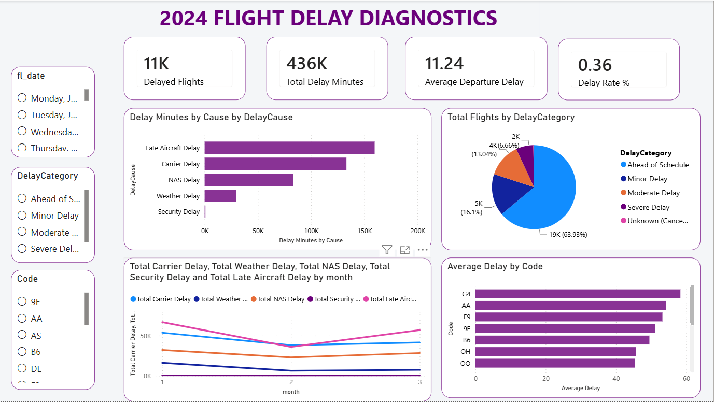

**Page purpose:** Root cause analysis — moving from "what happened" to "why it happened."

**Key visuals:**
- 4 KPI cards: Delayed Flights (11K), Total Delay Minutes (436K), Average Departure Delay (11.24 min), Delay Rate % (0.36)
- Horizontal bar chart: Delay Minutes by Cause — Late Aircraft Delay dominates at ~160K minutes, followed by Carrier Delay (~130K), NAS Delay (~83K), Weather Delay (~30K)
- Pie chart: Total Flights by Delay Category — 63.93% ahead of schedule/on time
- Multi-line chart: Delay cause breakdown by month — all delay types dip in February then rise slightly in March
- Bar chart: Average Delay by Carrier Code — G4 (Allegiant) leads at ~58 min, followed by AA (~54 min) and F9 (~53 min)
- Slicers: fl_date, DelayCategory, Code

**Story:** Late aircraft delay (cascading from earlier legs) is the single largest cause at 37% of total delay minutes — a systemic scheduling problem, not a random event.

---

### Page 3 — Airport and Route Analysis

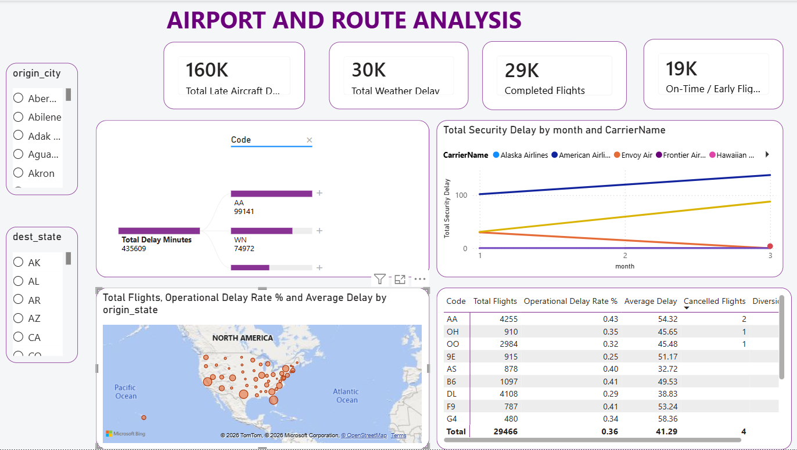

**Page purpose:** Geographic and route-level analysis — where delays are concentrated and how carriers compare on all key metrics simultaneously.

**Key visuals:**
- 4 KPI cards: Total Late Aircraft Delay (160K), Total Weather Delay (30K), Completed Flights (29K), On-Time/Early Flights (19K)
- Decomposition bar: Total Delay Minutes by carrier code — AA (99,141 min) and WN (74,972 min) contribute ~40% of all delay
- Line chart: Total Security Delay by month and carrier — American Airlines shows highest and rising security delay trend
- Bubble map: US geographic distribution of flights by origin state — bubble size = flight volume, positioned across all US states
- Carrier performance table: Code, Total Flights, Operational Delay Rate %, Average Delay, Cancelled Flights, Diversions — sortable multi-metric comparison showing AA (43% delay rate, 4,255 flights) vs DL (29% delay rate, 4,108 flights)
- Slicers: origin_city, dest_state

**Story:** Geographic concentration is clear — highest volumes from eastern seaboard states. The performance table reveals DL (Delta) outperforms AA by 14 percentage points despite operating a similar number of flights, proving high volume does not require high delay rates.

---

## Six Most Important DAX Measures — Explained

### 1. Total Flights
**What:** Counts all flight records in the current filter context using `COUNTROWS`.
**Why useful:** Foundation KPI and denominator for all rate calculations.
**Filter context:** Responds to all slicers — carrier, origin, date, delay category.
**Dashboard use:** Primary KPI card on Page 1; denominator in Delay Rate, Cancellation Rate, Diversion Rate.

### 2. Delay Rate
**What:** `DIVIDE([Delayed Flights], [Total Flights], 0)` — proportion of flights delayed >15 min.
**Why useful:** Normalized benchmark enabling fair comparison across carriers of different sizes.
**Filter context:** When carrier slicer active, automatically produces carrier-specific rate.
**Dashboard use:** KPI card, carrier bar chart (Page 1), carrier performance table (Page 3).

### 3. Total Delay Minutes (SUMX)
**What:** `SUMX` iterates row by row summing all five delay cause columns before aggregating.
**Why useful:** Shows absolute impact of delays and enables cause breakdown — SUMX handles nulls correctly across five columns simultaneously.
**Filter context:** Responds to all filters; carrier-specific when Code slicer active.
**Dashboard use:** KPI card (Page 2), horizontal bar chart by delay cause (Page 2), decomposition tree (Page 3).

### 4. Carrier Delay Rank (RANKX)
**What:** `RANKX(ALL(...), [Delay Rate], , DESC, Dense)` — ranks all 15 carriers by delay rate simultaneously.
**Why useful:** Immediate competitive positioning — identifies worst performing carrier at a glance.
**Filter context:** `ALL()` removes carrier filter so all carriers rank against each other even when one is selected.
**Dashboard use:** Carrier performance table (Page 3).

### 5. Delay Performance (VAR + CALCULATE/ALL)
**What:** Uses VAR to store carrier delay rate and overall rate, IF to return "Above Average" or "Below Average".
**Why useful:** Contextualizes performance — a 20% delay rate means different things depending on whether the industry average is 15% or 25%.
**Filter context:** `CALCULATE([Delay Rate], ALL(flight_data_2024))` explicitly removes all filters to compute the true overall rate.
**Dashboard use:** Conditional formatting column in carrier table (Page 3).

### 6. Delay Rate vs Overall (VAR + CALCULATE/ALL)
**What:** Calculates percentage point gap between carrier rate and overall average (positive = worse, negative = better).
**Why useful:** Quantifies the magnitude of the performance gap, not just its direction.
**Filter context:** Same ALL() pattern as Delay Performance — overall rate computed independently of current filter.
**Dashboard use:** Diverging color bar chart on Page 3 (red = worse than average, green = better).
